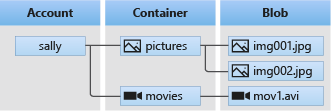

# Azure Blob Storage SDK

Documentation: [Azure Storage Blobs client library for Python - Version 12.11.0](https://docs.microsoft.com/en-us/python/api/overview/azure/storage-blob-readme?view=azure-python)

## What is Azure Blob Storage?

**Azure Blob storage** is Microsoft's object storage solution for the cloud. Blob storage is optimized for storing massive amounts of unstructured data, such as **text or binary data**.

Blob storage is ideal for:

1. Serving images or documents directly to a browser
2. Storing files for distributed access
3. Streaming video and audio
4. Storing data for backup and restore, disaster recovery, and archiving
5. Storing data for analysis by an on-premises or Azure-hosted service

## Getting started

1. Python 3.6 or late
2. azure-storage-blob
3. Azure account and subscription
4. Azure Storage account

```{bash}
# Install azure-storage-blob
pip install azure-storage-blob
```

The **Azure Storage Blobs client** library for Python allows you to interact with three types of resources: 

1. the storage account itself
2. blob storage containers, and
3. blobs (files)

Interaction with these resources starts with an instance of a client. 
To create a client object, you will need the storage account's blob service account URL and a credential that allows you to access the storage account:

```{python}
from azure.storage.blob import BlobServiceClient

service = BlobServiceClient(account_url="https://<my-storage-account-name>.blob.core.windows.net/", credential=credential)
```

How to read multiple files from a storage container in Azure functions?
[](https://stackoverflow.com/questions/69978830/how-to-read-multiple-files-from-a-storage-container-in-azure-functions)

> tl;dr:
> It seems I had a misunderstanding about how Azure Functions works. Because it is still Python code and Azure has a Python SDK available to connect to a Storage account and manipulate files, this is the best way to achieve the task that I was trying to accomplish.
The input/output bindings of Azure Functions is only helpful when using specific triggers it seems, but this was not required for my problem.

---

## Blob storage Bindings

| Action                                      | Type           |
| ----------                                  | -----          |
| Run a function as blob storage data changes | Trigger        |
| Read blob storage data in a function        | Input binding  |
| Allow a function to write blob storage data | Output binding |

---

## Object model

Azure Blob Storage is optimized for storing **massive amounts of unstructured data.**
Unstructured data is data that doesn't adhere to a particular data model or definition, such as **text** or **binary data**.
Blob storage offers three types of resources:

1. The storage account
2. A container in the storage account
3. A blob in the container

The following diagram shows the relationship between these resources.



Use the following **Python classes** to interact with these resources:

1. `BlobServiceClient`: The BlobServiceClient class allows you to manipulate **Azure Storage resources and blob containers**.
2. `ContainerClient`: The ContainerClient class allows you to manipulate **Azure Storage containers and their blobs**.
3. `BlobClient`: The BlobClient class allows you to manipulate **Azure Storage blobs**.
